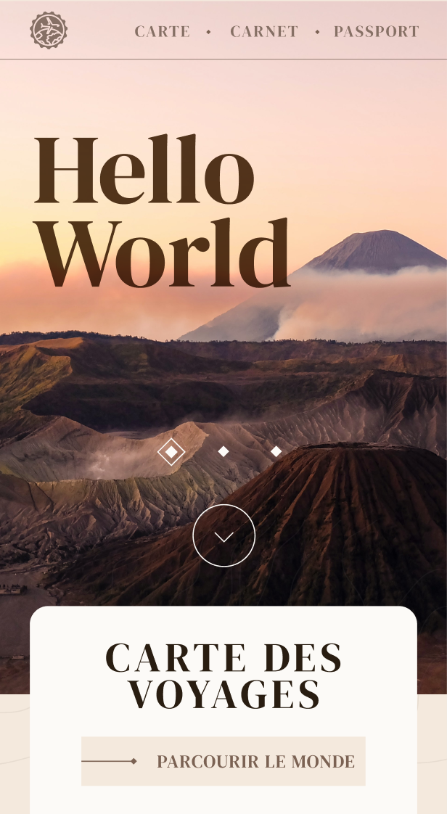
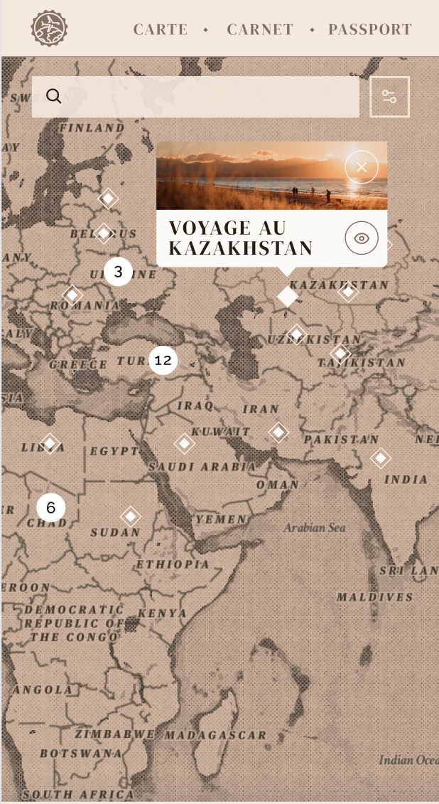

# Hello World

Le carnet de voyage en ligne
## Stack

**Client:** React JS, Tailwind CSS

**Server:** PHP avec le framework Symfony


## Dream Team

- [@Louise BAULAN](https://github.com/Fayaah)
- [@Matisse LIVAIN](https://github.com/MLivain)
- [@Nicolas NOTARARIGO](https://github.com/Neerfix)
- [@Emeline PAL](https://github.com/emelinepal)
- [@Aimée RITLENG](https://github.com/Aimee-RTLNG)
- [@Gregg SANCHEZ](https://github.com/Arty3P)
- [@Romain FRECHET](https://github.com/Hikari-rom)


## Screenshots

|                     Page d'accueil                     |                    Map intéractive                    |
|:------------------------------------------------------:|:-----------------------------------------------------:|
|  |  |

## Cloner le projet en local

Utiliser le lien GitHub

```bash
  git clone https://github.com/helloworld-ynovlyon/webapp.git
```

Aller dans le dossier du projet

```bash
  cd webapp
```

Installer les dépendances

```bash
  npm install
```

Lancer le serveur

```bash
  npm start
```


## Suivi des Sprints

- [Sprint 1](https://github.com/helloworld-ynovlyon/webapp/milestone/1) (14/02/2022 - 18/02/2022)
  - Maquettage, Initialisation du projet React JS, Début du développement (features, pages)
  - Poids total du sprint : **40**


- [Sprint 2](https://github.com/helloworld-ynovlyon/webapp/milestone/2) (07/03/2022 - 11/03/2022)
    - xx
    - Poids total du sprint : **xx**